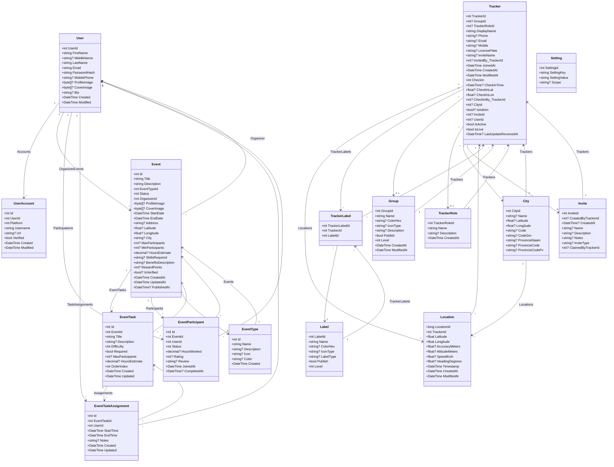

# SocialMotive.Core.Models — Class Diagram

```mermaid
classDiagram
    direction TB

    class User {
        +int UserId
        +string FirstName
        +string? MiddleName
        +string LastName
        +string Email
        +string PasswordHash
        +string? MobilePhone
        +byte[]? ProfileImage
        +byte[]? CoverImage
        +string? Bio
        +DateTime Created
        +DateTime Modified
    }

    class UserAccount {
        +int Id
        +int UserId
        +int Platform
        +string Username
        +string? Url
        +bool Verified
        +DateTime Created
        +DateTime Modified
    }

    class Event {
        +int Id
        +string Title
        +string Description
        +int EventTypeId
        +int Status
        +int OrganizerId
        +byte[]? ProfileImage
        +byte[]? CoverImage
        +DateTime StartDate
        +DateTime EndDate
        +string? Address
        +float? Latitude
        +float? Longitude
        +string? City
        +int? MaxParticipants
        +int? MinParticipants
        +decimal? HoursEstimate
        +string? SkillsRequired
        +string? BenefitsDescription
        +int? RewardPoints
        +bool? IsVerified
        +DateTime CreatedAt
        +DateTime UpdatedAt
        +DateTime? PublishedAt
    }

    class EventType {
        +int Id
        +string Name
        +string? Description
        +string? Icon
        +string? Color
        +DateTime Created
    }

    class EventParticipant {
        +int Id
        +int EventId
        +int UserId
        +int Status
        +decimal? HoursWorked
        +int? Rating
        +string? Review
        +DateTime JoinedAt
        +DateTime? CompletedAt
    }

    class EventTask {
        +int Id
        +int EventId
        +string Title
        +string? Description
        +int Difficulty
        +bool Required
        +int? MaxParticipants
        +decimal? HoursEstimate
        +int OrderIndex
        +DateTime Created
        +DateTime Updated
    }

    class EventTaskAssignment {
        +int Id
        +int EventTaskId
        +int UserId
        +DateTime StartTime
        +DateTime EndTime
        +string? Notes
        +DateTime Created
        +DateTime Updated
    }

    class Tracker {
        +int TrackerId
        +int? GroupId
        +int? TrackerRoleId
        +string DisplayName
        +string? Phone
        +string? Email
        +string? Mobile
        +string? LicensePlate
        +string? InviteName
        +int? InvitedBy_TrackerId
        +DateTime JoinedAt
        +DateTime CreatedAt
        +DateTime ModifiedAt
        +int CheckIn
        +DateTime? CheckInTime
        +float? CheckInLat
        +float? CheckInLon
        +int? CheckInBy_TrackerId
        +int? CityId
        +bool? IsAdmin
        +int? InviteId
        +int? UserId
        +bool IsActive
        +bool IsLive
        +DateTime? LastUpdateReceivedAt
    }

    class TrackerRole {
        +int TrackerRoleId
        +string Name
        +string? Description
        +DateTime CreatedAt
    }

    class TrackerLabel {
        +int TrackerLabelId
        +int TrackerId
        +int LabelId
    }

    class Label {
        +int LabelId
        +string Name
        +string? ColorHex
        +string? IconType
        +string? LabelType
        +bool Publish
        +int Level
    }

    class Group {
        +int GroupId
        +string Name
        +string? ColorHex
        +string? IconType
        +string? Description
        +bool Publish
        +int Level
        +DateTime CreatedAt
        +DateTime ModifiedAt
    }

    class City {
        +int CityId
        +string? Name
        +float? Latitude
        +float? Longitude
        +string? Code
        +string? CodeGm
        +string? ProvincieNaam
        +string? ProvincieCode
        +string? ProvincieCodePv
    }

    class Invite {
        +int InviteId
        +int? CreatedByTrackerId
        +DateTime? CreatedAt
        +string? Name
        +string? Description
        +string? Notes
        +string? InviteType
        +int? ClaimedByTrackerId
    }

    class Location {
        +long LocationId
        +int TrackerId
        +float Latitude
        +float Longitude
        +float? AccuracyMeters
        +float? AltitudeMeters
        +float? SpeedKmh
        +float? HeadingDegrees
        +DateTime Timestamp
        +DateTime CreatedAt
        +DateTime ModifiedAt
    }

    class Setting {
        +int SettingId
        +string SettingKey
        +string SettingValue
        +string? Scope
    }

    %% ──────────────────────────────────────
    %% RELATIONSHIPS
    %% ──────────────────────────────────────

    User "1" --> "*" UserAccount : Accounts
    User "1" --> "*" Event : OrganizerEvents
    User "1" --> "*" EventParticipant : Participations
    User "1" --> "*" EventTaskAssignment : TaskAssignments

    EventType "1" --> "*" Event : Events

    Event "1" --> "*" EventTask : EventTasks
    Event "1" --> "*" EventParticipant : Participants
    Event "*" --> "1" EventType
    Event "*" --> "1" User : Organizer

    EventParticipant "*" --> "1" Event
    EventParticipant "*" --> "1" User

    EventTask "1" --> "*" EventTaskAssignment : Assignments
    EventTask "*" --> "1" Event

    EventTaskAssignment "*" --> "1" EventTask
    EventTaskAssignment "*" --> "1" User

    Group "1" --> "*" Tracker : Trackers
    TrackerRole "1" --> "*" Tracker : Trackers
    City "1" --> "*" Tracker : Trackers
    City "1" --> "*" Location : Locations
    Invite "1" --> "*" Tracker : Trackers

    Tracker "1" --> "*" Location : Locations
    Tracker "1" --> "*" TrackerLabel : TrackerLabels
    Tracker "*" --> "0..1" Group
    Tracker "*" --> "0..1" TrackerRole
    Tracker "*" --> "0..1" City
    Tracker "*" --> "0..1" Invite

    TrackerLabel "*" --> "1" Tracker
    TrackerLabel "*" --> "1" Label
    Label "1" --> "*" TrackerLabel : TrackerLabels

    Location "*" --> "1" Tracker
```
