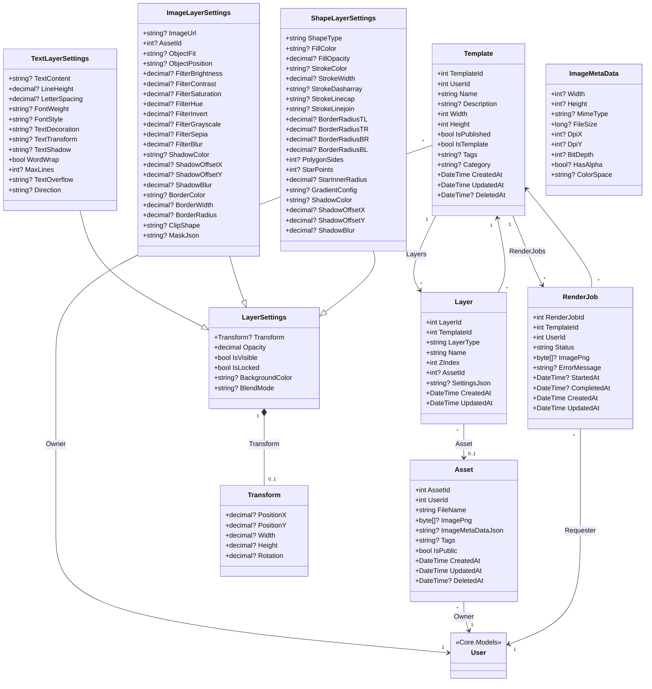

# SocialMotive.Core.Models.Generator — Class Diagram

```mermaid
classDiagram
    direction TB

    class Template {
        +int TemplateId
        +int UserId
        +string Name
        +string? Description
        +int Width
        +int Height
        +bool IsPublished
        +bool IsTemplate
        +string? Tags
        +string? Category
        +DateTime CreatedAt
        +DateTime UpdatedAt
        +DateTime? DeletedAt
    }

    class Layer {
        +int LayerId
        +int TemplateId
        +string LayerType
        +string Name
        +int ZIndex
        +int? AssetId
        +string? SettingsJson
        +DateTime CreatedAt
        +DateTime UpdatedAt
    }

    class Asset {
        +int AssetId
        +int UserId
        +string FileName
        +byte[]? ImagePng
        +string? ImageMetaDataJson
        +string? Tags
        +bool IsPublic
        +DateTime CreatedAt
        +DateTime UpdatedAt
        +DateTime? DeletedAt
    }

    class RenderJob {
        +int RenderJobId
        +int TemplateId
        +int UserId
        +string Status
        +byte[]? ImagePng
        +string? ErrorMessage
        +DateTime? StartedAt
        +DateTime? CompletedAt
        +DateTime CreatedAt
        +DateTime UpdatedAt
    }

    class LayerSettings {
        +Transform? Transform
        +decimal Opacity
        +bool IsVisible
        +bool IsLocked
        +string? BackgroundColor
        +string? BlendMode
    }

    class TextLayerSettings {
        +string? TextContent
        +decimal? LineHeight
        +decimal? LetterSpacing
        +string? FontWeight
        +string? FontStyle
        +string? TextDecoration
        +string? TextTransform
        +string? TextShadow
        +bool WordWrap
        +int? MaxLines
        +string? TextOverflow
        +string? Direction
    }

    class ImageLayerSettings {
        +string? ImageUrl
        +int? AssetId
        +string? ObjectFit
        +string? ObjectPosition
        +decimal? FilterBrightness
        +decimal? FilterContrast
        +decimal? FilterSaturation
        +decimal? FilterHue
        +decimal? FilterInvert
        +decimal? FilterGrayscale
        +decimal? FilterSepia
        +decimal? FilterBlur
        +string? ShadowColor
        +decimal? ShadowOffsetX
        +decimal? ShadowOffsetY
        +decimal? ShadowBlur
        +string? BorderColor
        +decimal? BorderWidth
        +decimal? BorderRadius
        +string? ClipShape
        +string? MaskJson
    }

    class ShapeLayerSettings {
        +string ShapeType
        +string? FillColor
        +decimal? FillOpacity
        +string? StrokeColor
        +decimal? StrokeWidth
        +string? StrokeDasharray
        +string? StrokeLinecap
        +string? StrokeLinejoin
        +decimal? BorderRadiusTL
        +decimal? BorderRadiusTR
        +decimal? BorderRadiusBR
        +decimal? BorderRadiusBL
        +int? PolygonSides
        +int? StarPoints
        +decimal? StarInnerRadius
        +string? GradientConfig
        +string? ShadowColor
        +decimal? ShadowOffsetX
        +decimal? ShadowOffsetY
        +decimal? ShadowBlur
    }

    class Transform {
        +decimal? PositionX
        +decimal? PositionY
        +decimal? Width
        +decimal? Height
        +decimal? Rotation
    }

    class ImageMetaData {
        +int? Width
        +int? Height
        +string? MimeType
        +long? FileSize
        +int? DpiX
        +int? DpiY
        +int? BitDepth
        +bool? HasAlpha
        +string? ColorSpace
    }

    %% ──────────────────────────────────────
    %% INHERITANCE
    %% ──────────────────────────────────────

    TextLayerSettings --|> LayerSettings
    ImageLayerSettings --|> LayerSettings
    ShapeLayerSettings --|> LayerSettings

    %% ──────────────────────────────────────
    %% COMPOSITION
    %% ──────────────────────────────────────

    LayerSettings "1" *-- "0..1" Transform : Transform

    %% ──────────────────────────────────────
    %% RELATIONSHIPS
    %% ──────────────────────────────────────

    Template "1" --> "*" Layer : Layers
    Template "1" --> "*" RenderJob : RenderJobs

    Layer "*" --> "1" Template
    Layer "*" --> "0..1" Asset : Asset

    RenderJob "*" --> "1" Template

    %% ──────────────────────────────────────
    %% CROSS-NAMESPACE (external refs)
    %% ──────────────────────────────────────

    class User {
        <<Core.Models>>
    }

    Template "*" --> "1" User : Owner
    Asset "*" --> "1" User : Owner
    RenderJob "*" --> "1" User : Requester
```
